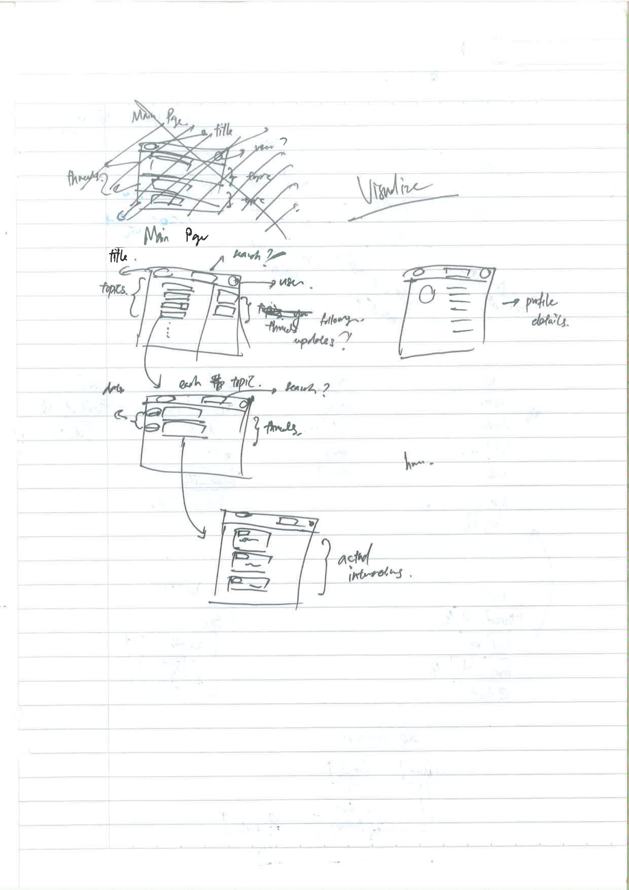

# Session 2 - Actual Development: The Practicals

## Table of Content

- [Session 2 - Actual Development: The Practicals](#session-2---actual-development-the-practicals)
  - [Table of Content](#table-of-content)
  - [Homework Sharing Session](#homework-sharing-session)
  - [Expectations & Outcomes](#expectations--outcomes)
  - [A brief mention on version control](#a-brief-mention-on-version-control)
  - [Pre Development](#pre-development)
    - [Key features](#key-features)
  - [Planning & Designing the application](#planning--designing-the-application)
    - [Visualize](#visualize)
    - [Modelling](#modelling)
    - [Interaction](#interaction)
  - [Research](#research)
  - [Frontend (React Native)](#frontend-react-native)
    - [Starting from Design](#starting-from-design)
    - [Best Practises](#best-practises)
    - [Design Guidelines](#design-guidelines)
    - [Before we continue, a litte context since JS moves faster than the speed of light](#before-we-continue-a-litte-context-since-js-moves-faster-than-the-speed-of-light)
    - [What's React & React Native(Expo)](#whats-react--react-nativeexpo)
    - [Why React](#why-react)
    - [Beginning of the Project](#beginning-of-the-project)
    - [A brief introduction to React and its few core concepts](#a-brief-introduction-to-react-and-its-few-core-concepts)
    - [The use of React Component Libraries](#the-use-of-react-component-libraries)
    - [The first page, the Home Page](#the-first-page-the-home-page)
    - [Continue on the Home Page](#continue-on-the-home-page)
    - [Mocking data](#mocking-data)
    - [Starting on the Related Thread page](#starting-on-the-related-thread-page)
    - [Profile](#profile)
    - [Let's not forget logging in, and signing up](#lets-not-forget-logging-in-and-signing-up)
  - [Backend](#backend)
    - [Enter our framework of the day: Django](#enter-our-framework-of-the-day-django)
      - [On the nature of django web framework](#on-the-nature-of-django-web-framework)
    - [Virtual environment for Python](#virtual-environment-for-python)
    - [Development tools](#development-tools)
    - [Starting development! Creating a new django project](#starting-development-creating-a-new-django-project)
    - [Creating our first app in django](#creating-our-first-app-in-django)
    - [Defining the models](#defining-the-models)
    - [Views](#views)
    - [Serialization and Rendering: Comparing Null differences](#serialization-and-rendering-comparing-null-differences)
    - [Routing and URLS](#routing-and-urls)
    - [API design](#api-design)
    - [Autogen Documentation](#autogen-documentation)
    - [Connecting Front and Back](#connecting-front-and-back)
  - [Testing and Test Driven Development](#testing-and-test-driven-development)
    - [Test Coverage](#test-coverage)

## Homework Sharing Session

Let's share about the 5 articles that we've read last week!

## Expectations & Outcomes

Before this course, you are expected to:

- Had participated in the first workshop (if you didn't, I'm sad, go read up on the materials on Github.)
- Have some experience in programming
- Have revisioned basic knowledge on Javascript and Python

The expected outcomes after this workshop is:

- Understands how applications are generally built
- Learns basic knowledge of React and Django with DRF
- Understands the underlying mechanisms of Web Frameworks
- Understands Web API design
- Understands the importance of testing

In this tutorial, let's make a simple forum application!

With this, let's start the software development process that we are familiar before.

But before we start...

## A brief mention on version control

Version Control Systems(VCS) had become one of the most crucial develop tools ever since their release. VCS allows developers to record changes done to a set of files over time so we can **recall specific versions or changes later**. Furthermore, with VCS, we can **easily collaborate** as well, given that the changes each user made can be easily compared and even merged.

We will be using the **Git** VCS throughout the session, so go get it if you haven't.

## Pre Development

It's time to apply what we've learnt last week.

Using the flow:

1. Aim
2. Goal
3. Visualize
4. Modelling
5. Interaction
6. Research
7. Development
8. Present
9. Iterate
10. Hit

Let's first define the **Aim** and the **Goal** of the application.

Since we don't really have a client defined for us now, let's imagine the client is the School of Computer Science, and they approach us for the development of the forum.

What may be the **aim** of the forum then? Remember, the **aim** represents the business needs, or the actual intention that motivates the creation of the software (What the client wants).

Well, maybe the school wants to **connect with its student better**? Or maybe, the school wants a more **engaging learning environment**?

That certainly seems plausible, so after asking our clients, maybe they ended up actually having this as their **aim**.

After getting to know their **aim**, we now want to know the **goals** of this application. Remember, the **goals** describes how the software should solve the problem.

In this case, a forum makes sense. With a forum, students can easily communicate to discuss about important issues between each other and also lecturers. All the information that was recorded can also be easily accessed by new incoming students if they have any issues with, becoming a good source of references. The school can also see student's progress judging by the questions ask, and easily address some concerns that they might have. These all fulfilled the **aim** to some degree. (Food for thought: is there a better idea?)

So now, we have these information:

1. Aim: To better connect with students and create an engaging learning environment.
2. Goals: Forums for School of Computer Science, providing a place for lecturers and students to communicate.

### Key features

Now we have some information, coming up with some key features becomes easier. Keeping them in mind, we can come up with these features:

1. Users must be able to login using their university accounts
2. Users must be able to make threads on certain topics
3. There should be multiple topics that users can make threads on, so that the website is catogorically organized
4. User should be able to reply to threads
5. User should be able to search threads
6. User should be able to see the newest threads on the first page, based on categories
7. There should be 3 types of user: Students, Lecturers, Admin
8. Admin must be able to moderate threads (Delete)

## Planning & Designing the application

With the requirements done, we can look to design and plan for the application!

### Visualize

Let's start with visualizing the application. As said before, this is the step where we try to visualize how a application would look and hopefully from that we can understand more about the application we are going to develop on. This step is particularlly useful especially if one have access to frequent client feedback.

So, from the requirements we draw a general sketch on what would it look like.



As you may see, it is generally a low fidelity prototype, designed to have an idea on how things should happen **from a visual persective (frontend view I guess)**

Everything here needn't be fully set in stone, its just a tool for us to understand the application more. However, when communicating with client or if there is a need for documentation, evolving this to a higher detail design is okay as well.

If the visualization can be confirmed, we can also evolve it to a more detailed design to be used by frontend.

### Modelling

Now, we proceed to model the data of the application. There is multiple ways to do modelling for the application, but all of them have the same goal: to **show how data represented and what data is needed in the application**. This show how things works **in terms of data (backend view)**.

We can choose to show the data modelling with ERD. I normally use a severly lacking ERD to roughly draft out the data modelling, and "upgrade" it to a full scale ERD if need be afterwards.

The modelling should be done with requirements in mind, and should be able to capture data needed based on the requirements, be it the data from input, currently processed, output, records or third party, anything that would. However, take note that we do not need to model the data flow, merely needing to model those that we would be using. In a simple sense, one could say that we are actually aleady designing the database.


One thing that people might be curious about especially those with some database knowledge is the applicability of ERD for NoSQL databases, especially since some of them don't really utilize concepts like keys, joins or relations. For that, I would argue that here we are mainly using ERD as a tool to visualize the data models involved, and that there is value in having a glimps, especially when you are trying to generally plan out your application and understand more about it.

### Interaction

Now that we have the visualization and the data models, we can proceed to design the interaction. The interaction here refers to that of the interactions of frontend and backend, detailing how data is essentially passed around the entire application. What we are essentially doing can be said to be designing the high level view for the API.

One way of doing that can be so:


This can be a little difficult to understand, but all the rectangles refers to each visual page, and each circle refers to each data model. 3rd party APIs can also be included, represented as a triangle here, connecting to the data model.

In another sense, the interaction can also represent the essential **architecture** of the application, represented like so:


You might notice that we've gone for the client-server architecture here, mainly due to the material that we are covering (React frontend and Django Backend), which utilizes a SPA frontend that allows it to be more reactive if needed. This architecture also allow extention into a mobile application if need be in the future, as the APIs can be shared for both the SPA and the native app.

Do note that, this application can be done fully from django alone with a fully server side architecture, with good results. In fact, I believe most forums employ the fully server side architecture as forums do not really need the reactivity with their use case, so you can say we are slightly overengineering this.

*Note: Shape in the architecture example do not hold meanings, they are meant to seperate things only*

## Research

In most cases, research will be done on key features that are more unique in nature, which are usually not really found on the current market. Research would also be done on things that are not known to the developer.

These research affects the implementation of key features and thus the other aspects of the application, such as the UI (visualization), the database design (data modelling) and even the API and architectural design (interactions). This is why research, although placed after the planning phase, is normally done throughout the previous phase as well.

After the planning phase, the research would be more about how the implementation would work, and what technology best fit the problem faced. In this case, we are trying to learn React and Django with DRF, so we would just say that we've chose this as our approach.

## Frontend (React Native)

A well known and effective approach to software development is the front-to-back approach. This implies that the development starts from the frontend instead of from the backend. This is generally a good idea as it is very hard for us to get an idea on how the application will be like if we start from modelling the data, thus requiring more changes in the backend.

Here, things would start to get technical. Do try to keep up, and if there are any questions, please do ask me.

### Starting from Design

Before we actually dive into coding for frontend, we first have to design the interface that we want. We do this via various tools, such as Sketch or Adobe XD. Using these tools, we can first define how the application would look like before getting our hands dirty with coding, which is more expensive to create and implement, reducing time taken for development.

From your design, you would want to capture a few things:

1. The general look and feel, the theme of the application (color scheme, fonts etc)
2. The functionality of each pages
3. The interaction between pages

### Best Practises

There is a few things you should be looking out for when designing as well, the so called best practises.

1. Responsiveness: What you create should be able to adapt to any screen size **nicely**
2. Consistency is key: ensure your margins, paddings, fonts sizes, and other things are all consistent
3. Don't use too much colour, choose a pallette: Too much colours just makes it annoying
4. Use whitespaces: Whitespace ensure that use would get clouded by too much information at once
5. Make it Dumb & Simple: Make everything simple enough that even a new user can use it rather quickly
6. SHOW the main point: Make the things you want user to see more obvious

There's a lot more out there, feel free to look for them.

### Design Guidelines

Professionals from big companies spent a lot of time on designing a good interface for their user to ensure that user have good experiences when using their product. From these experiences, they had come up with design guidelines which can help us design product better. These are some of them:

1. [Microsoft Design](https://www.microsoft.com/design)
2. [Apple Design](https://developer.apple.com/design/)
3. [Ant Design](https://ant.design/)
4. [Material Design](https://material.io/design/)
5. Etc. Many design guidelines are out there, with frameworks implementing them. Discover!

### Before we continue, a litte context since JS moves faster than the speed of light

When studying React & React Native here, we will be using the newer **React Hooks** since its not only easier to read but also understand, and people had been stating its perks (quotation needed).

Do note that you may use whatever library APIs provided by React to achieve the same purpose.

### What's React & React Native(Expo)

> ReactJS is an open source JavaScript library designed by Facebook for creating rich and engaging web apps fast and efficiently with minimal coding.
> React Native combines the best parts of native development with React.
> Expo is an open-source platform for making universal native apps for Android, iOS, and the web with JavaScript and React.

### Why React

- Reusable Component
- Freedom
- Flexible
- Readable
- Reactive and Fast
- Easy to Learn
- Good ecosystem

### Beginning of the Project
<!-- 
In the folder, you can see `.gitignore`, which is a file that tells git what folder/file to ignore when checking into version control. There is `App.js` which is the main entry point to the application. `app.json` defines the configuration of the application, such as the icon, the supported platform and the name of the application. `babel.config.js` helps compile javascript into a suitable version for expo and react-native, which in this case, should be compiling it for native. `.expo` and `.expo-shared` folders are configuration for expo, when you are running the application for debugging. Finally, `package.json`, `package-lock.json` and `node_modules` are all for dependencies management, keeping track of downloaded dependencies. -->

### A brief introduction to React and its few core concepts

First of all, React Native is basically just React but for mobiles. Thus, most of them would feel similar to you if you had ever played with react.

Try looking into `App.js`, the code you are looking at is es6, which is a standard for javascript that improves it. Basically, it is still javascript, similar to what was used for web sites and all.

The HTML like syntax that you might have notice, is called JSX. Its basically like templating, which allows you to insert markup language inside code. The structure is intuitive especially to people coming from web development.

Another thing you might have noticed is the fact that a function is returning the markup. In this case, the function can now be referred to as a React component. A component is some UI or non-UI element that does a certain thing, which can be use to build bigger things (an application). Components can be designed to be reusable, which reduces development time when a repetitive component would be needed. Components accepts parameters from their parents or creator, called **props** (properties), which allows some data to be conveyed from parents to child. Each component can also have their own **state**, which is variables that would affect the behaviour/view of the component as it changes.

One can write components using functions or classes. Any function returning JSX would be recognised as a compoenent. As for classes, to become a component it would have to inherit the React.Component class. Both approaches are viable, but here since we are utilizing React Hooks, we will mainly focus on using functions.

### The use of React Component Libraries

React component libraries refers to libraries(or code) written by other people filled with reusable components that we can use directly. We ae using those here since they allow us to code easier. However, do remember that they are no different from us implementing the code ourselves!

### The first page, the Home Page

### Continue on the Home Page

### Mocking data

### Starting on the Related Thread page

### Profile

### Let's not forget logging in, and signing up

## Backend

With our frontend completed, its time to move towards to backend. The implementation of the logic underneath. For backend, we will be using python with a certain web framework.

### Enter our framework of the day: Django

> Django is a high-level Python Web framework that encourages rapid development and clean, pragmatic design. Built by experienced developers, it takes care of much of the hassle of Web development, so you can focus on writing your app without needing to reinvent the wheel. It’s free and open source.

Let's get it installed and readied. Make sure you have Python installed (version 3.6+), and lets get it started.

#### On the nature of django web framework

One thing that might get you confused here is how people would sometimes describe django as a **backend framework**. One thing that need to be made clear is that django is a **web framework**, infering that it is a **framework for building web application**. Django have the ability to employ templating which generates HTMl dynamically, common in a fully server side architecture (In which case you can argue that it does the front and backend together, but it is technically still a backend...), or it can decide to implement a HTTP API interface instead, returning JSON or XML, common in client-server architecture and microservices (which is more clear as it only handles mostly backend stuff). Both of them actually achieve the same outcome, with different presentation of data returned as a result of the processing (remember about http/s?). Basically, don't worry too much about the terms.

### Virtual environment for Python

Most often than not in development, we will rely on other people's packages. We install them to our machine, and import them in our application. Normally there are two spaces that you install in, the global space(system wide install) or the project space(local install). Most cases, unless our libraries are widely used by us in every single project, we wouldn't want them to be installed globally to prevent unintended conflict when dealing with multiple project, especially when each project might potentially have different dependencies.

Enter virtual environment, where python creates a virtual space where every dependencies/packages would be store in one place. This ensures that each project would be self contained, preventing versioning conflict between projects from happening so often.

To do that, you simple need to do this:

```bash
python -m venv .venv
```

This would create a virtual env inside the current directory.

We then activate the environment so that we can work in it.

```bash
# Windows CMD
call .venv/Scripts/activate.bat

# Windows Powershell
.venv/Scripts/activate

# Mac & Linux
# You might have to install extra package via your system package manager, specifically the package python3-venv
source .venv/bin/activate
```

After activating the virtual environment, you should see something similar to this in the command line, which indicates you are in the environment:

```bash
(.venv) $
```

Let's check `pip freeze`, which shows the packages installed for python. It should show nothing for now, but we are going to add in some packages to help us in development, specifically django.

```bash
# Make sure you are in a virtual environment
pip install django
```

Now let's do `pip freeze` again, and this time you should see something like this:

```bash
$ pip freeze
Django==2.2.7
pytz==2019.3
sqlparse==0.3.0
```

The packages are installed within the virtual env!

### Development tools

Now, before we begin the actual development, we will need some tool to help us better in ensuring that the dev process would be smooth and comfortable. To do that, you can install these 2 packages:

```bash
pip install flake8 black
```

`flake8` is a linter, which looks through your code to tell you any syntatic error or bugs that you might encounter. They are basically code spell checkers.

`black` is a formatter, which enforces a style on the code you write, and help formats your code nicely.

These plugins works nicely with ides or code editors, and if you are using VSCode with the Python Plugin, they would help alot during development.

### Starting development! Creating a new django project

Let's start off by creating a new django project! We can do that simply by doing so:

```bash
django-admin startproject forum
```

A folder called forum should be created with the following file structure:

```bash
forum/
    manage.py
    forum/
        __init__.py
        settings.py
        urls.py
        wsgi.py
```

Let me offer a little bit of explaination. We've just created a project called `forum`. Inside this project there is a folder also called `forum`, which is the package of your actual project, and act as a place for you to configure project wide settings with `settings.py`, and configure routing to other apps via `urls.py`. `manage.py` is a command line utility that allows you to do things with the project easily.

Now, let's try running the project. To do so, simply do `python manage.py runserver` and it should start running. You would see something like so:

```bash
$ python manage.py runserver
Watching for file changes with StatReloader
Performing system checks...

System check identified no issues (0 silenced).

You have 17 unapplied migration(s). Your project may not work properly until you apply the migrations for app(s): admin, auth, contenttypes, sessions.
Run 'python manage.py migrate' to apply them.
November 18, 2019 - 04:11:46
Django version 2.2.7, using settings 'forum.settings'
Starting development server at http://127.0.0.1:8000/
Quit the server with CTRL-BREAK.
```

Go to the url given at http://127.0.0.1:8000/ and you should see this.


Nice!

### Creating our first app in django

With it up and running, let's now create our first app in django. In django, we refer to the entire project as a *"project"*, and a module as *"app"*. We can either create our own app, or we can use third party app that we might need for our use case. To create an app, we can utilize the `manage.py` utility like so:

```bash
# Let's create our first app
python manage.py startapp threads
```

Here, we create an app called threads. Why name it so? Well, let's refer back to the modelling diagram we drew back then:


### Defining the models

### Views

### Serialization and Rendering: Comparing Null differences

### Routing and URLS

### API design

### Autogen Documentation

### Connecting Front and Back

Now, with the api defined, we can connect our frontend with the backend. Let's implment this functionality.

## Testing and Test Driven Development

If you haven't notice, we haven't been writing a single line of test cases ever since we started the tutorial which is fine because we are just trying to learn the basics. However, when developing commercialized application, testing can be crucial that your application do not fail during production, which may cause a major financial loss.

So, how do we do testing then? Well there are multiple types of tests:

1. Unit Testing
2. Integration Testing
3. Functional Testing (End-to-end)
4. Ad-hoc testing
5. Sanity Tests
6. Acceptance Tests (Alpha & Beta tests)

### Test Coverage

Test coverage is a useful metric that measures the amount of testing performed by the tests. Basically, test coverage is the measure of how much of the code is covered by the tests, via gathering information on which part of the code is executed during testing phase.

Using test coverage, we can ensure that most if not all of out code are tested, by finding out areas that are not covered.
